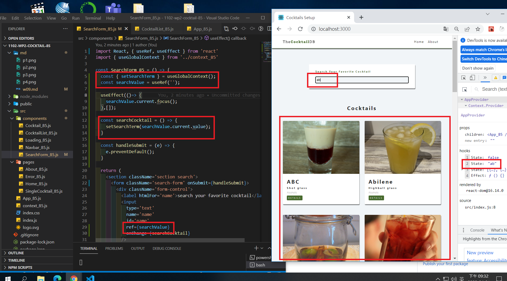
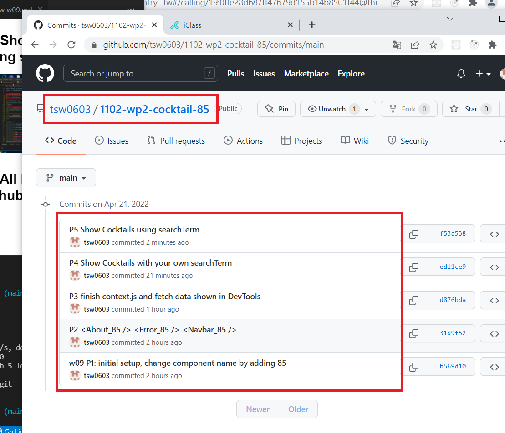

### P1: initial setup, change component name by adding 85

### P2 <About_85 /> <Error_85 /> <Navbar_85 />

### P3 finish context.js and fetch data shown in DevTools

### P4 Show Cocktails with your own searchTerm

### P5 Show Cocktails using searchTerm

### P6 All log message in Github

